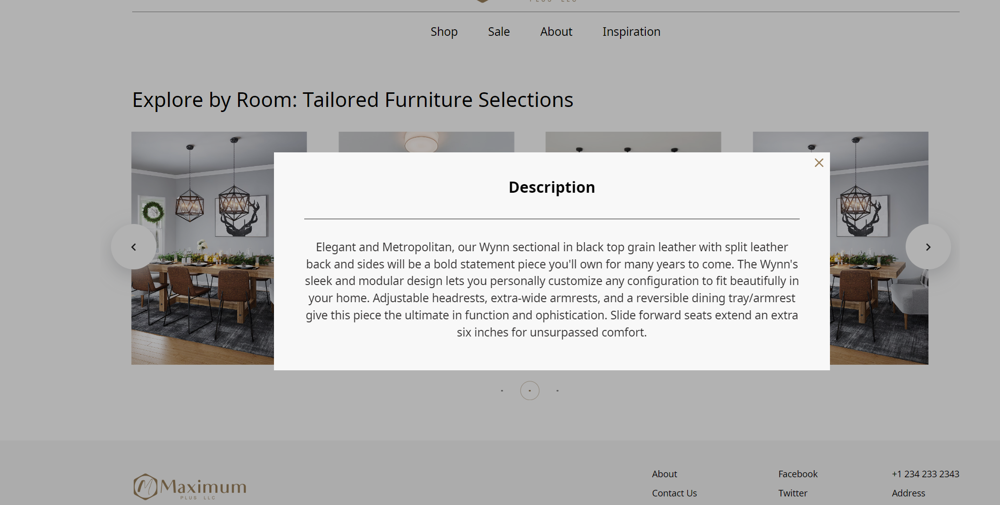
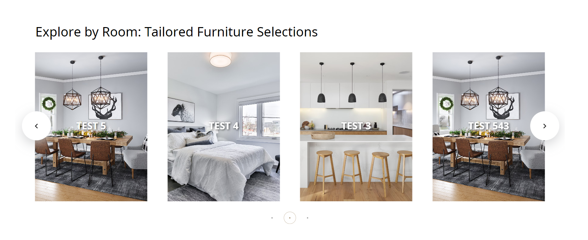

# WordPress Slider with Custom Post Type and AJAX Modal

## Description

This project adds a custom post type Slider to WordPress, allowing you to create and manage slides. The slides include a title, description, and image. A frontend slider displays the latest 10 slides, where clicking on a slide opens a modal window with the slide description fetched via AJAX.

## Features

- **Custom Post Type**: Slider with fields for title, description, and featured image.
- **Frontend Slider**: Displays the latest 10 slides with a user-friendly design.
- **Modal Window**: Fetches and displays the slide description using AJAX.
- **AJAX Integration**: Ensures smooth content loading without page reloads.

## Screenshots

